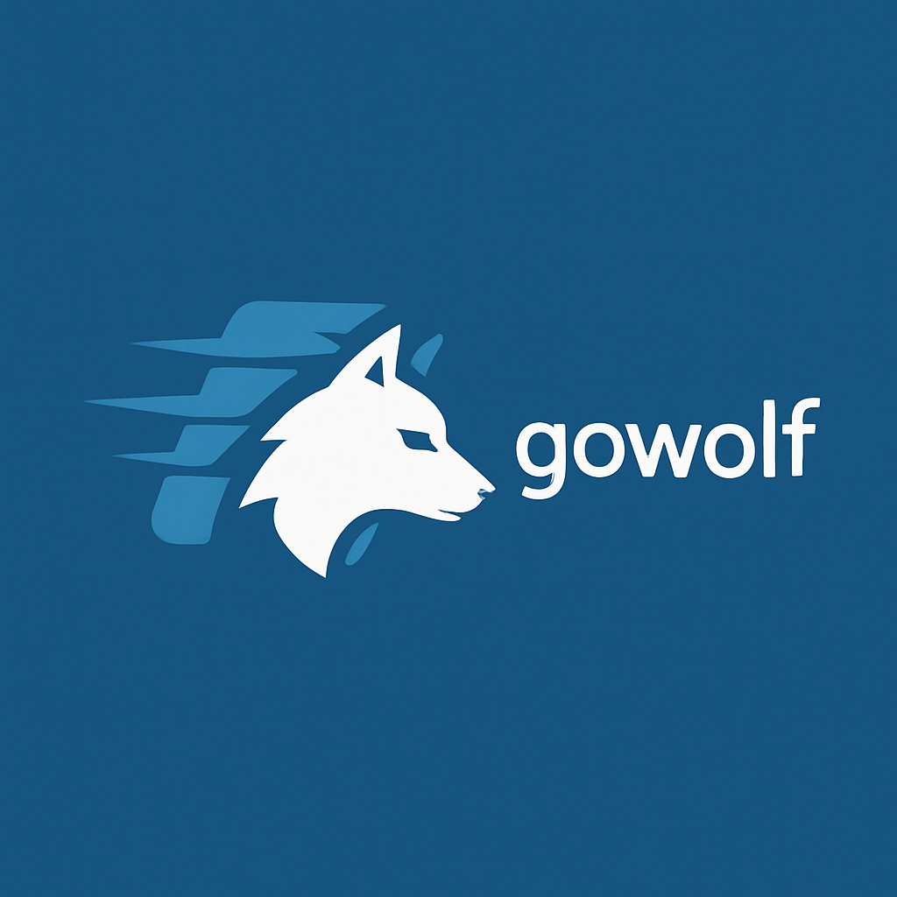

<div align="center">
  
</div>
<br/><br/>
A high-performance, production-ready web framework for Go that combines the developer-friendly API of Gin with the speed of Fiber.

[](https://golang.org/)
[](https://godoc.org/github.com/aliwert/go-wolf)
[](https://opensource.org/licenses/MIT)
[](https://goreportcard.com/report/github.com/aliwert/go-wolf)

## ✨ Features

- 🚀 **High Performance** - Optimized for speed with minimal memory allocations
- 🛣️ **Powerful Routing** - Static, dynamic, and wildcard route matching
- 🧩 **Middleware System** - Built-in and custom middleware support
- 📦 **Request Binding** - JSON, form, and query parameter binding with validation
- 🎨 **Flexible Rendering** - JSON, HTML, and custom response types
- 🛡️ **Error Handling** - Centralized error handling with recovery
- 🔌 **Extensible** - Plugin system and hooks for customization
- 🧪 **Well Tested** - Comprehensive test coverage

## 📦 Installation

```bash
go get github.com/aliwert/go-wolf
```

## 📊 Benchmarks

```
BenchmarkWolf_GithubAPI        20000000    85.6 ns/op      0 B/op    0 allocs/op
BenchmarkGin_GithubAPI        20000000    91.2 ns/op      0 B/op    0 allocs/op
BenchmarkFiber_GithubAPI      30000000    62.1 ns/op      0 B/op    0 allocs/op
```

## 🤝 Contributing

Contributions are welcome! Please read our [Contributing Guide](CONTRIBUTING.md) for details on our code of conduct, development process, and how to submit pull requests.

## 📄 License

This project is licensed under the MIT License - see the [LICENSE](LICENSE) file for details.
